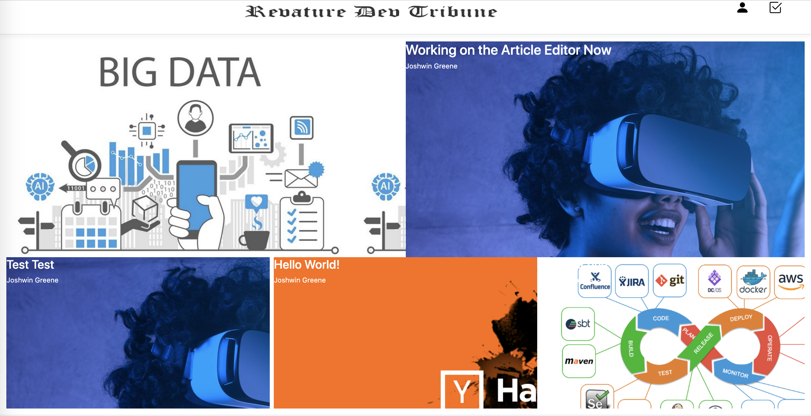
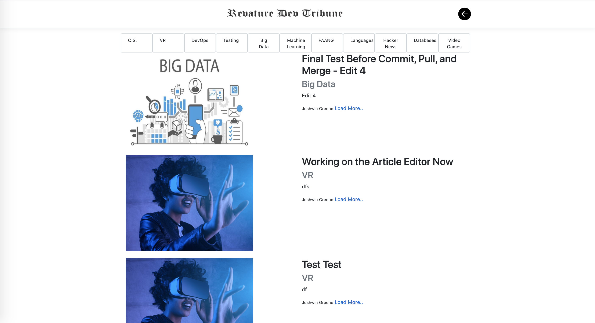

# Revature Dev Tribune

## Project Description

Revature Dev Tribune is a web application that serves as both a developer-focused news website and content management system. It was inspired by the limited edition issue of The Daily Coder newspaper from CommitStrip's Kickstarter in 2016. The goal of this application is to allow publishers of the Revature Dev Tribune to create, edit, and publish articles. Similarly, readers of the Revature Dev Tribune will be able to read and interact with said articles.

## Technologies Used

- ASP.NET Core
- C#
- SQL
- EF Core
- MVC
- HTML
- CSS
- Bootstrap
- GitHub Actions (DevOps)
- Azure
- Web API (Web Services)
- Docker
- xUnit
- SonarCloud

## Features

### Ready Features

* Login as either a reader or author
* Search and reader articles at your leisure
* Wrtie and publish an article as an author

### To Do List

* Social Interactions with Comments and Likes
* Tie in External API

## Getting Started

1. Clone the project
2. Dotnet restore in both the Service and MVC directories
3. Dotnet Watch Run in StoreApi.Service and MvcApp.Client

## Usage

1. Home Page

2. Author Article View

3. Create New Article

4. Okta Author Login

5. Reader Signup

5. Reader Article Browse

## License

* MIT
